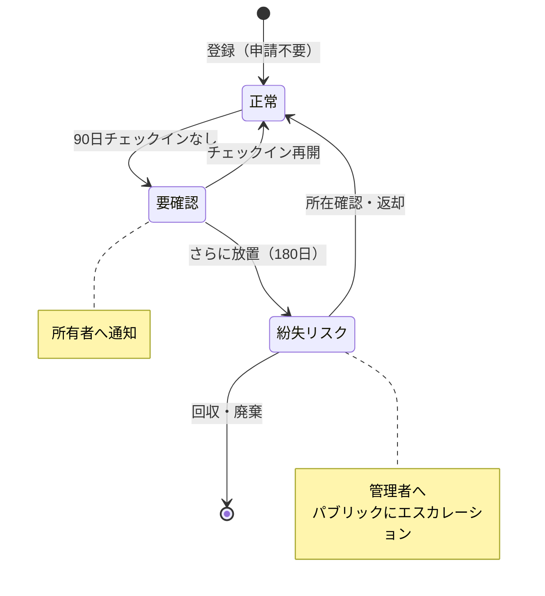
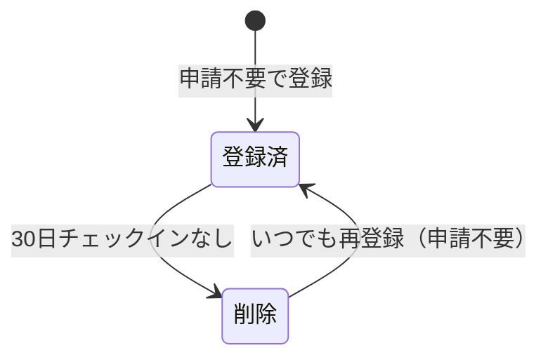
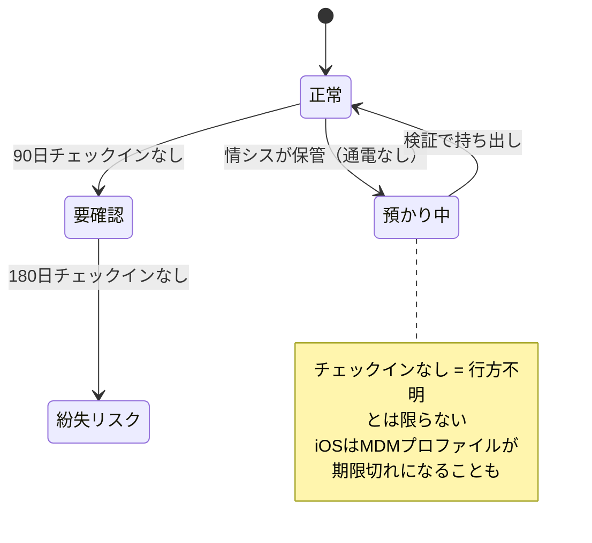
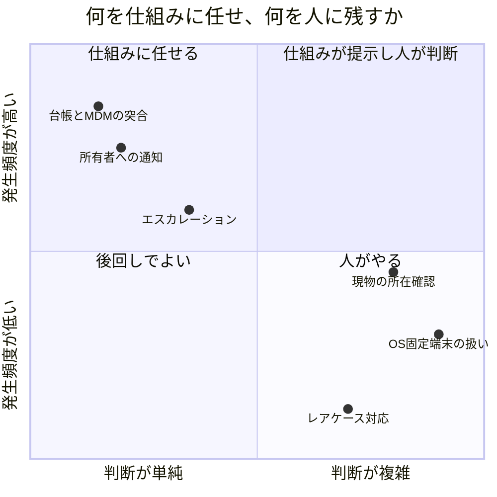
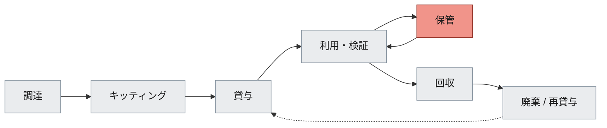
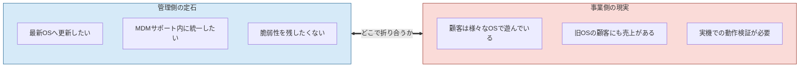
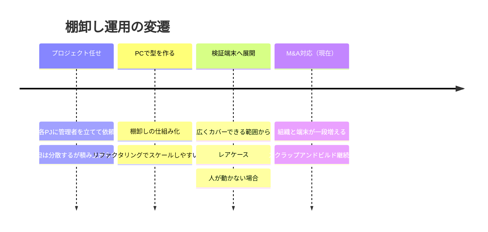

# BTCONJP 2026 スライド図解設計

> セッション「『棚卸しお願いします』を減らすために」の図解方針。
> GitHub上（PRの画面）でMermaid図がレンダリングされます。

---

## 結論：単一フレームワークより「視覚言語の統一」

このセッションの主張は **「人がやっていた部分を、質を落とさずに仕組みへ移し続けている」** です。
つまり話の全編を貫くのは *人と仕組みの境界線が動いていく* という一本の軸。

そこで、フレームワークを1つ選ぶより **全図を通して色の意味を固定する** ほうが効きます。

| 色 | 意味 | 用途 |
|---|---|---|
| 🟠 オレンジ | **人**がやっている | As-Isで支配的。減っていくほど話が進む |
| 🔵 ブルー | **仕組み**がやっている | 増えていく |
| ⚪ グレー | 未着手・これから | レアケース、今後の課題 |
| 🔴 レッド | 事業都合による**例外** | OS固定、長期保管など |

この4色を全スライドで統一すると、聴衆は**凡例を1回覚えるだけで、以降どの図も色だけで読める**ようになります。
「オレンジが減ってブルーが増える」という画の変化そのものが、このセッションのストーリーになります。

---

## 1. WBS（作業分解構成図）× 人／仕組みの色分け ★中核

ご質問の作業分解構成図を当てはめると、こうなります。
**ポイントは、WBSを"作業の一覧"としてではなく"色を塗る土台"として使うこと。**
同じWBSを3回見せ、色だけを変えることで変遷を語ります。

### 1-A. As-Is（プロジェクト任せだった頃）

```mermaid
flowchart TD
    R([デバイス棚卸し運用]):::root

    R --> W1[1 台帳を正しく保つ]:::mid
    R --> W2[2 ズレを是正する]:::mid
    R --> W3[3 ライフサイクルを回す]:::mid
    R --> W4[4 例外に対応する]:::mid

    W1 --> W11[1.1 端末情報の登録]:::human
    W1 --> W12[1.2 台帳とMDMの突合]:::human
    W1 --> W13[1.3 差分の検知]:::human

    W2 --> W21[2.1 所有者への確認]:::human
    W2 --> W22[2.2 管理者への催促]:::human
    W2 --> W23[2.3 現物の所在確認]:::human
    W2 --> W24[2.4 回収・返却]:::human

    W3 --> W31[3.1 調達・キッティング]:::human
    W3 --> W32[3.2 貸与]:::human
    W3 --> W33[3.3 保管]:::human
    W3 --> W34[3.4 回収・廃棄]:::human

    W4 --> W41[4.1 OS固定端末]:::human
    W4 --> W42[4.2 BYOD]:::human
    W4 --> W43[4.3 レアケース]:::none

    classDef root fill:#2C3E50,stroke:#1B2631,color:#ffffff
    classDef mid fill:#EAECEE,stroke:#85929E,color:#1a1a1a
    classDef human fill:#F6C177,stroke:#9A6A1F,color:#1a1a1a
    classDef system fill:#7FB3D5,stroke:#1F618D,color:#1a1a1a
    classDef none fill:#D5D8DC,stroke:#7B7D7D,color:#1a1a1a
```



→ **ほぼ全部オレンジ。** 「各プロジェクトの善意と手作業で支えていた」が一目で伝わります。

### 1-B. 現在（突合と催促を仕組みへ移した後）

```mermaid
flowchart TD
    R([デバイス棚卸し運用]):::root

    R --> W1[1 台帳を正しく保つ]:::mid
    R --> W2[2 ズレを是正する]:::mid
    R --> W3[3 ライフサイクルを回す]:::mid
    R --> W4[4 例外に対応する]:::mid

    W1 --> W11[1.1 端末情報の登録<br/>申請不要化]:::system
    W1 --> W12[1.2 台帳とMDMの突合]:::system
    W1 --> W13[1.3 差分の検知]:::system

    W2 --> W21[2.1 所有者への通知]:::system
    W2 --> W22[2.2 管理者へエスカレーション]:::system
    W2 --> W23[2.3 現物の所在確認]:::human
    W2 --> W24[2.4 回収・返却]:::human

    W3 --> W31[3.1 調達・キッティング]:::human
    W3 --> W32[3.2 貸与]:::human
    W3 --> W33[3.3 保管]:::except
    W3 --> W34[3.4 回収・廃棄]:::human

    W4 --> W41[4.1 OS固定端末]:::except
    W4 --> W42[4.2 BYOD<br/>30日で自動整理]:::system
    W4 --> W43[4.3 レアケース]:::none

    classDef root fill:#2C3E50,stroke:#1B2631,color:#ffffff
    classDef mid fill:#EAECEE,stroke:#85929E,color:#1a1a1a
    classDef human fill:#F6C177,stroke:#9A6A1F,color:#1a1a1a
    classDef system fill:#7FB3D5,stroke:#1F618D,color:#1a1a1a
    classDef none fill:#D5D8DC,stroke:#7B7D7D,color:#1a1a1a
    classDef except fill:#F1948A,stroke:#943126,color:#1a1a1a
```



→ **「気づく」側（1.x・2.1・2.2）が青くなり、「直す」側（2.3・2.4）はオレンジのまま。**
これがセッションの核である *線引き* をそのまま可視化した図になります。言葉で説明するより速い。

→ 赤い2つ（保管・OS固定端末）が柱6につながる伏線になります。

### 1-C. これから（M&A後のスケール要件）

同じWBSに「M&Aで増える組織」の軸を掛けて、
どのワークパッケージがスケールしないかをグレーに塗り直す版を用意すると、柱7の締めになります。

> ⚠️ **要確認**: 上記の色分けはこれまでの会話から推定したものです。特に 3.x（ライフサイクル）と 4.1（OS固定端末）の
> 現状が人手なのか一部仕組み化済みなのか、実態に合わせて塗り直してください。

---

## 2. 状態遷移図：閾値とエスカレーション ★柱4の山場

90日・180日の設計は本質的に**ステートマシン**なので、状態遷移図が最適です。
表で日数を並べるより、状態と遷移条件で見せるほうが「設計している感」が出ます。



### BYODは別のステートマシン



→ 「締め付けるのではなく、出入り自由にして放置分だけ整理する」という発想が図で伝わります。

### 応用：この図の"穴"を見せる ★柱6への橋渡し



→ **「単純な日数では割り切れない」という論点を、前の図との差分で示せます。**
同じ図に状態を1つ足すだけなので、聴衆が理解を積み上げやすい構成です。

---

## 3. 象限図：自動化の線引きの判断基準 ★柱5

「どこまでを仕組みに任せるか」は言葉で説明すると抽象的になりがちなので、2軸に落とします。



→ 「頻度が高くて判断が単純なものから仕組みへ寄せた」という着手順の合理性が一目で伝わります。
→ **プロットの位置は仮置き**です。実感に合わせて動かしてください。

---

## 4. ライフサイクル図：ポリシーで決めるべき分岐 ★柱2

「ポリシーの言語化が先」という主張は、**どこに判断ポイントがあるかを示す図**とセットにすると効きます。



→ 各ノードに「ここで何を決めておくべきか」を吹き出しで足していくと、柱2が図だけで進行できます。
→ 保管（赤）だけがループを持つ＝ここが厄介、という構造も同時に示せます。

---

## 5. 対立構造図：セキュリティの定石 vs 事業の現実 ★柱6の前半

OS固定の話は、対立を対立として描くのがいちばん伝わります。



→ 「正解が一つに決まらない」ことを図の形（左右対称・矢印が双方向）で表現できます。
→ ここは**answerを出さずに問いのまま置く**のが誠実で、かつ議論を呼びます。

---

## 6. タイムライン：変遷と現在地 ★柱1・柱7



→ 冒頭（柱1）でグレーアウトした状態で見せ、終盤（柱7）で全部点灯させると、話の一貫性が出ます。

---

## 7. カバレッジ図：広い範囲から埋めていく ★柱4

Mermaidでは同心円が描けないため、これはスライドツールで作図してください。構造だけ示します。

```
        ┌─────────────────────────┐
        │  ④ 人が動かない場合      │  ← まだ埋めている最中
        │  ┌───────────────────┐  │
        │  │ ③ レアケース        │  │
        │  │  ┌─────────────┐   │  │
        │  │  │ ② 例外あり    │   │  │
        │  │  │ ┌─────────┐ │   │  │
        │  │  │ │① 大多数  │ │   │  │  ← 最初にここを仕組み化
        │  │  │ └─────────┘ │   │  │
        │  │  └─────────────┘   │  │
        │  └───────────────────┘  │
        └─────────────────────────┘
```

→ 内側から順に色が塗られていくアニメーションにすると「広くカバーできるところから」が直感的に伝わります。
→ 一番外側が塗り切れていない＝「まだ途中」という締めにも接続します。

---

## 図解の使い分けまとめ

| 柱 | 内容 | 推奨フレームワーク | 節 |
|---|---|---|---|
| 1 | As-Is | WBS（オレンジ一色）＋ タイムライン（グレー） | 1-A, 6 |
| 2 | 順番論 | ライフサイクル図 ＋ 判断ポイントの吹き出し | 4 |
| 3 | PCで型を作る | 構成図のBefore/After（横展開できる形への抽象化） | ※要作図 |
| 4 | 検証端末へ広げる | 状態遷移図 ＋ カバレッジ同心円 | 2, 7 |
| 5 | 線引き | WBS（色が変わった版）＋ 象限図 | 1-B, 3 |
| 6 | 検証端末の難所 | 対立構造図 ＋ 状態遷移図の"穴"版 | 5, 2応用 |
| 7 | M&Aと現在地 | タイムライン（全点灯）＋ WBS（スケールしない箇所） | 6, 1-C |

### 作図で気をつけること

- **色の意味は絶対に変えない。** 途中で意味が変わると聴衆は色を読まなくなります
- **1スライド1メッセージ。** WBSのように情報量の多い図は、色だけを変えて複数回出す
- **同じ図を育てる。** 状態遷移図に状態を1つ足す、WBSの色を塗り替える——新しい図を毎回出すより理解が積み上がります
- **凡例は最初に1枚使って明示する。** ここをケチると以降の全図の効きが落ちます
- Mermaidはスライドに貼るには素っ気ないので、**構造検討はMermaidで、清書はスライドツールで**が現実的です

---

## 未確定・要検討

- [ ] WBSの粒度（1階層目を4つにしたが、実務の分け方と合っているか）
- [ ] 1-Bの色分けが実態と合っているか（特に 3.x ライフサイクルと 4.1 OS固定端末）
- [ ] 象限図のプロット位置を実感に合わせて調整
- [ ] 柱3のBefore/After構成図——「スケールしやすい構成」の中身が決まってから作図
- [ ] カバレッジ同心円の①〜④に入る具体的なケース名
